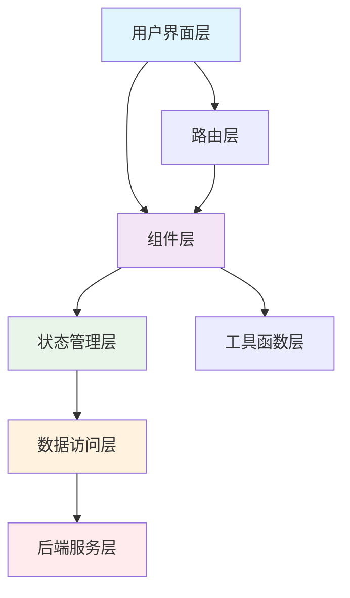
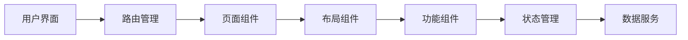
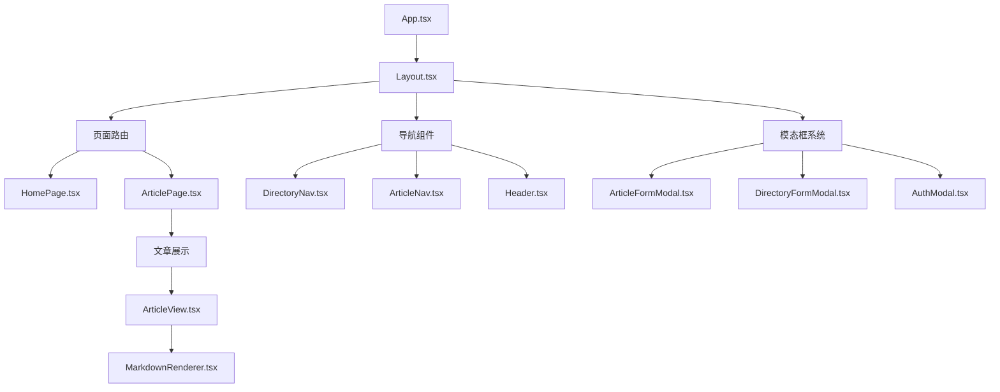
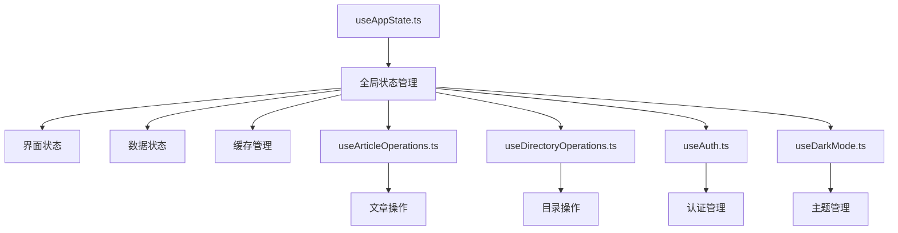
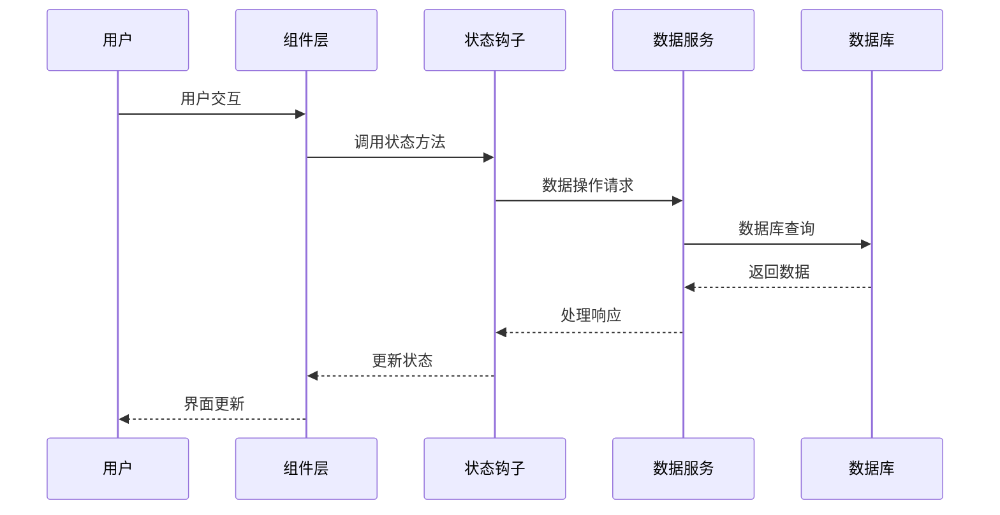
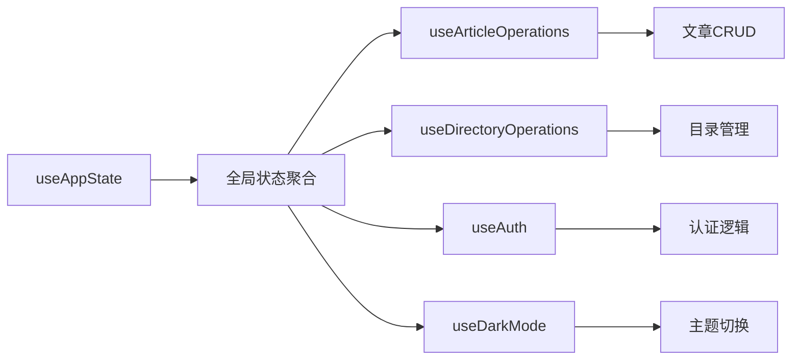
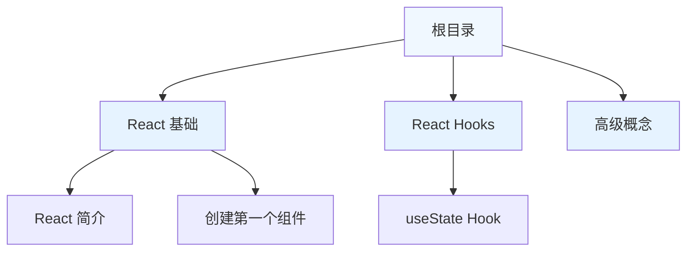
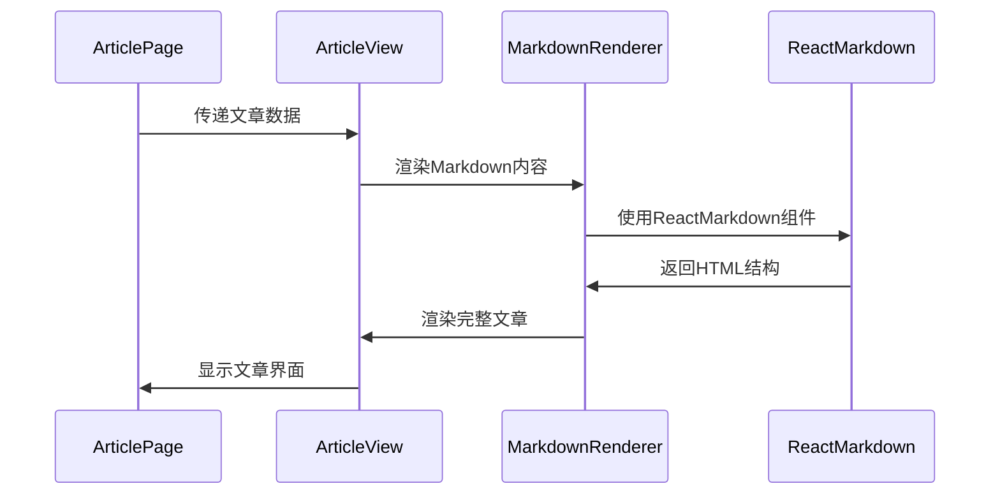
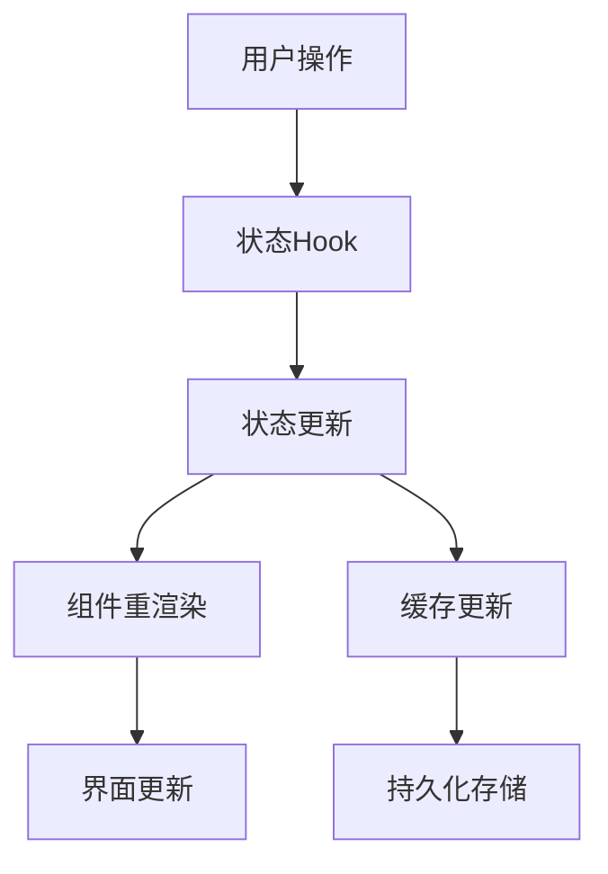
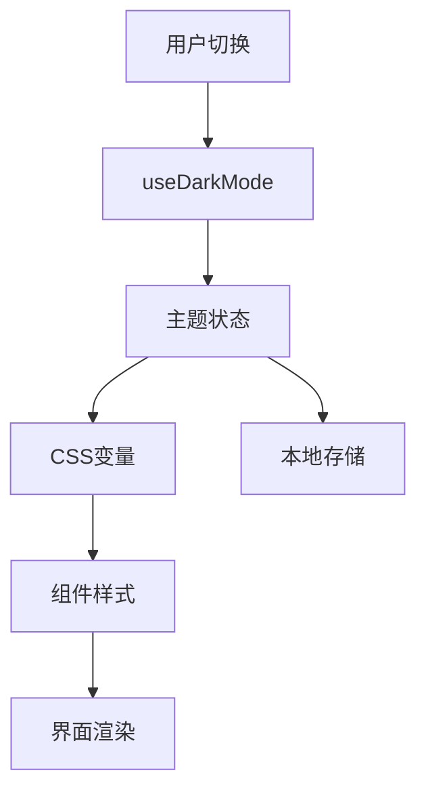

# React 学习平台 - 架构设计文档

## 📐 整体架构概览



## 🔧 技术架构详情

### 1. 分层架构设计



### 2. 组件架构层次



### 3. 状态管理架构



### 4. 数据流架构



## 🏗️ 核心模块设计

### 1. 应用入口架构

```
src/
├── main.tsx          # 应用启动入口
├── App.tsx           # 主应用组件
└── index.css         # 全局样式
```

**职责分工：**
- `main.tsx`: 应用初始化和路由配置
- `App.tsx`: 路由定义和布局包装
- 支持 HashRouter 确保跨环境兼容性

### 2. 页面层架构

```
pages/
├── HomePage.tsx      # 首页欢迎页面
└── ArticlePage.tsx   # 文章详情页面
```

**设计特点：**
- 页面级组件负责路由参数处理
- 通过 OutletContext 传递主题配置
- 清晰的页面切换逻辑

### 3. 布局组件架构

```
Layout.tsx (核心布局管理器)
├── 侧边栏管理 (DirectoryNav)
├── 头部导航 (Header)
├── 移动端侧边栏 (MobileSidebar)
├── 文章目录 (ArticleNav)
└── 模态框系统 (各种Modal)
```

**关键特性：**
- 响应式布局适配
- 动态主题切换
- 统一的模态框管理

### 4. 自定义 Hooks 架构



## 🎯 核心功能实现

### 1. 目录树结构设计



### 2. 文章渲染流程



### 3. 状态更新机制



## ⚡ 性能优化策略

### 1. 缓存设计

- **内存缓存**: useAppState 状态管理
- **本地存储**: localStorage 持久化缓存
- **数据预加载**: 智能缓存预热机制

### 2. 组件优化

- **懒加载**: React.lazy 动态导入
- **记忆化**: 合理使用 useMemo/useCallback
- **代码分割**: 路由级代码分割

### 3. 渲染优化

- **虚拟化**: 大型列表虚拟滚动
- **防抖节流**: 高频操作优化
- **图片优化**: SVG 图标和响应式图片

## 🔄 数据流设计

### 1. 单向数据流

```
用户操作 → 事件处理 → 状态更新 → 界面渲染
```

### 2. 事件通信机制

- **Props 传递**: 父子组件通信
- **Context API**: 跨组件状态共享
- **自定义事件**: 跨层级组件通信

## 🛡️ 错误边界设计

### 1. 错误处理策略

- **组件级错误捕获**: 关键组件错误边界
- **网络错误处理**: API 请求错误处理
- **用户友好提示**: 优雅的错误展示

## 📈 扩展性设计

### 1. 插件化架构

- **模块化组件**: 易于替换和扩展
- **配置驱动**: 环境变量配置
- **接口抽象**: 易于集成新功能

### 2. 国际化支持

- **i18n 就绪**: 文本外部化设计
- **多语言架构**: 支持多语言扩展

## 🎨 主题系统架构



## 🔍 监控和调试

### 1. 开发工具集成

- **React DevTools**: 组件调试
- **Redux DevTools**: 状态监控
- **性能分析**: 渲染性能监控

---

## 📋 总结

本项目采用现代化的 React 架构设计，具有以下特点：

### ✅ 优势
- **清晰的分层架构**
- **完善的类型安全**
- **良好的性能优化**
- **优秀的可维护性**

---
*文档版本: 1.0 | 最后更新: 2025-01-06*